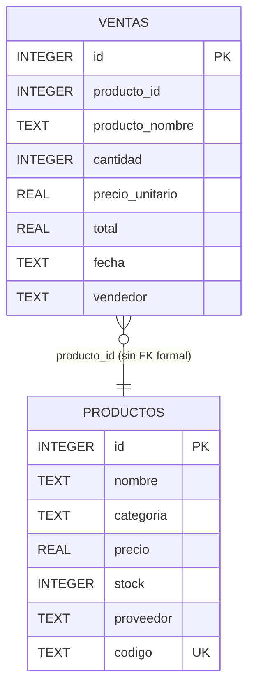
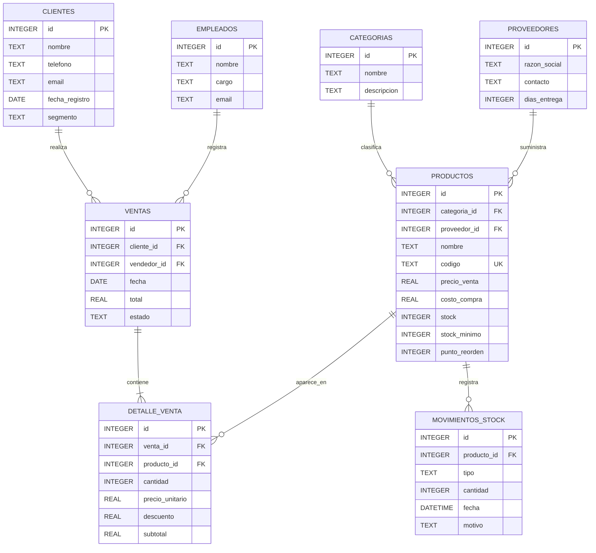

# 📋 Informe de Auditoría Técnica — Sistema Legacy Eco-Distribuidora S.A.

> **Actividad 1:** Auditoría de Sistemas Legacy — "Del Dato a la Decisión"  
> **Asignatura:** Sistemas de Información / Arquitectura de Software  
> **Formato de entrega:** GitHub — Markdown  
> **Equipo:** Squad [Nombre del equipo]  

---

## 👥 Integrantes del Squad

| Nombre | Rol en la auditoría | Sección principal |
|--------|---------------------|-------------------|
| [Integrante 1] | Arquitecto de datos | Diagrama BD + Fallas TGS |
| [Integrante 2] | Analista de negocio | Decisiones críticas |
| [Integrante 3] | Arquitecto DSS | Propuesta de evolución |
| [Integrante 4] | Analista ético | Conclusión ODS 8 |

---

## Índice

1. [Contexto del sistema analizado](#1-contexto-del-sistema-analizado)
2. [Diagrama de la base de datos actual](#2-diagrama-de-la-base-de-datos-actual-reverse-engineering)
3. [Análisis de fallas desde la Teoría General de Sistemas (TGS)](#3-análisis-de-fallas-desde-la-teoría-general-de-sistemas-tgs)
4. [Decisiones críticas que el sistema NO puede soportar](#4-decisiones-críticas-que-el-sistema-no-puede-soportar)
5. [Cuadro comparativo: CRUD Actual vs. DSS Necesario](#5-cuadro-comparativo-crud-actual-vs-dss-necesario)
6. [Propuesta de evolución hacia un DSS](#6-propuesta-de-evolución-hacia-un-dss)
7. [KPIs propuestos para el DSS](#7-kpis-propuestos-para-el-dss)
8. [Conclusión ética — Conexión con ODS 8](#8-conclusión-ética--conexión-con-ods-8)
9. [Checklist de evaluación](#9-checklist-de-evaluación)

---

## 1. Contexto del sistema analizado

**Eco-Distribuidora S.A.** opera con un sistema CRUD desarrollado en **Python (Flask) + SQLite** para gestionar el inventario de su tienda. El sistema fue generado como caso de estudio para esta auditoría y representa fielmente las limitaciones de sistemas legacy reales.

### Tecnologías del sistema actual

| Componente | Tecnología |
|------------|------------|
| Backend | Python 3.x + Flask |
| Base de datos | SQLite 3 (archivo local) |
| Frontend | HTML/CSS con templates Jinja2 |
| Despliegue | Local (un solo usuario) |

### Resumen ejecutivo del problema

El sistema registra datos pero **no genera inteligencia**. La gerencia de Eco-Distribuidora S.A. no puede responder preguntas básicas de negocio como:

- ¿Qué productos se agotarán en los próximos 15 días?
- ¿Qué clientes están comprando con menor frecuencia?
- ¿Qué categorías de productos generan mayor margen?

Esto no es un fallo técnico: es una falla de diseño arquitectónico que se explica desde la **Teoría General de Sistemas (TGS)**.

---

## 2. Diagrama de la base de datos actual (Reverse Engineering)

El sistema cuenta con **únicamente 2 tablas sin relación formal** (sin Foreign Key declarada en la base de datos):



### Problemas estructurales identificados en el esquema

#### 🔴 Problema 1 — Redundancia de datos (violación 2NF)

El campo `producto_nombre` en la tabla `VENTAS` es una **copia manual** del nombre del producto al momento de la venta. Si el nombre del producto se modifica en la tabla `PRODUCTOS`, las ventas históricas quedarán con información incorrecta e inconsistente.

```sql
-- Escenario problemático:
UPDATE productos SET nombre = 'Arroz Premium 1kg' WHERE id = 1;
-- Las ventas previas aún dicen 'Arroz Superior 1kg'
-- La consulta SELECT * FROM ventas ya no es confiable
```

#### 🔴 Problema 2 — Sin Foreign Key formal

Aunque existe el campo `producto_id` en `VENTAS`, SQLite **no tiene una restricción FK declarada**. Esto significa que es técnicamente posible insertar ventas con `producto_id = 9999` (inexistente) sin que el sistema lo detecte.

```python
# En app.py — la relación es lógica, no física:
producto = conn.execute("SELECT * FROM productos WHERE id=?", (pid,)).fetchone()
# Si el producto fue eliminado antes, la consulta devuelve None silenciosamente
```

#### 🔴 Problema 3 — Ausencia de entidades críticas para el negocio

| Entidad faltante | Por qué es indispensable |
|------------------|--------------------------|
| `CLIENTES` | Sin ella es imposible analizar comportamiento de compra, fidelización o abandono |
| `CATEGORIAS` | La categoría es un campo de texto libre, lo que genera inconsistencias ("Abarrotes", "abarrotes", "ABARROTES") |
| `PROVEEDORES` | El proveedor es texto libre, imposible gestionar relaciones comerciales |
| `MOVIMIENTOS_STOCK` | No hay historial de entradas de mercancía, solo salidas por venta |
| `COSTO_PRODUCTO` | Sin el campo costo no se puede calcular margen de ganancia |

---

## 3. Análisis de fallas desde la Teoría General de Sistemas (TGS)

La **Teoría General de Sistemas** (Bertalanffy, 1968) nos provee el marco conceptual para entender por qué este CRUD es insuficiente más allá de sus limitaciones técnicas.

### 3.1 Concepto clave: Sistema vs. Colección de partes

> *"El todo es más que la suma de sus partes"* — Ludwig von Bertalanffy

Un verdadero sistema no es solo un conjunto de componentes: es la **interacción entre ellos** la que genera valor emergente. El CRUD de Eco-Distribuidora tiene partes (tablas), pero no produce el valor superior que un sistema debería generar.

---

### 🔴 Falla TGS #1 — ENTROPÍA: Degradación progresiva de la información

**Definición:** La entropía en sistemas de información es la tendencia natural al desorden, la acumulación de datos inútiles o contradictorios que erosionan la calidad de la información con el tiempo.

#### Evidencia en el sistema

**Entropía tipo 1 — Datos obsoletos e inconsistentes:**

```
Estado inicial (día 1):
  productos.nombre = "Arroz Superior 1kg"
  ventas[1].producto_nombre = "Arroz Superior 1kg"  ← copia exacta ✓

Estado degradado (día 90):
  productos.nombre = "Arroz Premium 1kg"  ← actualizado
  ventas[1].producto_nombre = "Arroz Superior 1kg"  ← dato obsoleto ✗
  ventas[15].producto_nombre = "Arroz Premium 1kg"  ← dato nuevo ✓
  -- El historial de ventas ya no es coherente
```

**Entropía tipo 2 — Acumulación de ruido sin estructura:**

La tabla `VENTAS` muestra 50 filas sin paginación, sin agrupación, sin orden temporal útil. A medida que el negocio crece (500 ventas/mes → 6,000/año), la tabla se convierte en una masa de datos ilegible. No hay mecanismo de **neguentropía** (organización artificial que contrarreste el desorden).

**Entropía tipo 3 — Campos de texto libre sin normalización:**

Los campos `categoria`, `proveedor` y `vendedor` son texto libre. En 6 meses de operación real, una auditoría encontraría:

| Valor almacenado | Significado real |
|-----------------|------------------|
| `"Abarrotes"` | Categoría Abarrotes |
| `"abarrotes"` | Categoría Abarrotes |
| `"ABARROTES "` | Categoría Abarrotes (con espacio) |
| `"Abarotes"` | Categoría Abarrotes (error tipográfico) |

Un `GROUP BY categoria` devolvería 4 grupos distintos para la misma categoría.

#### Impacto en el negocio

La gerencia no puede confiar en los datos históricos. Cada decisión basada en reportes manuales extraídos del sistema tiene un margen de error creciente con el tiempo.

---

### 🔴 Falla TGS #2 — FALTA DE SINERGIA: Las partes no producen inteligencia colectiva

**Definición:** La sinergia es la propiedad de un sistema donde la interacción entre componentes produce un resultado mayor que la suma de sus contribuciones individuales.

#### Evidencia en el sistema

El sistema tiene `PRODUCTOS` (con stock) y tiene `VENTAS` (con cantidades). Pero **no cruza** esta información para generar valor estratégico:

```sql
-- Lo que el sistema PODRÍA calcular pero NO calcula:

-- ¿Cuántos días de stock quedan de cada producto?
SELECT 
    p.nombre,
    p.stock,
    AVG(v.cantidad) as venta_diaria_promedio,
    p.stock / AVG(v.cantidad) as dias_restantes
FROM productos p
JOIN ventas v ON p.id = v.producto_id
WHERE v.fecha >= date('now', '-30 days')
GROUP BY p.id;

-- Este cálculo EXISTE en los datos, pero el sistema jamás lo ejecuta.
-- La gerencia tiene que hacer esto manualmente en Excel, si es que puede.
```

La sinergia está ausente porque:
1. No hay vistas (`VIEW`) que crucen las tablas
2. No hay procedimientos almacenados ni lógica analítica
3. La capa de presentación solo hace `SELECT * FROM tabla` sin joins estratégicos

#### Impacto en el negocio

Dos departamentos que "tienen los datos" pero no los comparten ni los cruzan equivalen a no tener los datos. Eco-Distribuidora está pagando por almacenar información que nunca se convierte en conocimiento.

---

### 🟡 Falla TGS #3 — CAJA NEGRA: Sin retroalimentación al decisor

**Definición:** En la TGS, un sistema autorregulado necesita retroalimentación (*feedback*) para ajustar su comportamiento. Sin feedback, el sistema no puede corregir desviaciones.

#### Evidencia en el sistema

El sistema no genera **ninguna señal de alerta automática**. Los únicos indicadores son:
- Stock < 5 unidades → color rojo en la tabla

Pero este indicador:
- No envía notificación al encargado de compras
- No considera la velocidad de venta (5 unidades pueden durar 1 día o 6 meses)
- No activa ningún flujo de reorden

La gerencia debe **revisar manualmente** la tabla de productos cada día para detectar problemas. Esto convierte al humano en el "sensor del sistema", una labor que debería automatizarse.

---

## 4. Decisiones críticas que el sistema NO puede soportar

### Decisión crítica #1 — Reposición de inventario preventiva

**Pregunta de negocio:** ¿Qué productos debo pedir a mis proveedores esta semana para no quedarme sin stock?

**Por qué el sistema falla:**

El sistema no tiene:
- Historial de velocidad de venta por producto
- Cálculo de días de inventario restante
- Umbrales de reorden configurables
- Tiempo de entrega del proveedor

**Consecuencia real para Eco-Distribuidora:**
El encargado de compras revisa la columna de stock manualmente, toma decisiones basadas en intuición, y frecuentemente se producen quiebres de stock (pérdida de venta) o sobrestock (capital inmovilizado).

**Consulta SQL que el DSS debería ejecutar automáticamente:**
```sql
SELECT 
    p.nombre,
    p.stock,
    p.proveedor,
    ROUND(SUM(v.cantidad) / 30.0, 2) AS ventas_por_dia,
    ROUND(p.stock / (SUM(v.cantidad) / 30.0), 0) AS dias_restantes,
    CASE 
        WHEN p.stock / (SUM(v.cantidad) / 30.0) <= 7 THEN '🔴 URGENTE'
        WHEN p.stock / (SUM(v.cantidad) / 30.0) <= 15 THEN '🟡 ATENCIÓN'
        ELSE '🟢 OK'
    END AS estado
FROM productos p
JOIN ventas v ON p.id = v.producto_id
WHERE v.fecha >= date('now', '-30 days')
GROUP BY p.id
ORDER BY dias_restantes ASC;
```

---

### Decisión crítica #2 — Segmentación y retención de clientes

**Pregunta de negocio:** ¿Qué clientes están comprando menos? ¿Alguno dejó de comprar?

**Por qué el sistema falla:**

La tabla `VENTAS` tiene un campo `vendedor` (el empleado que registró la venta), **no existe el campo `cliente`**. El sistema es completamente ciego a quién compra.

**Consecuencia real para Eco-Distribuidora:**
- No se puede aplicar ninguna estrategia de fidelización
- No se detecta cuando un cliente frecuente deja de comprar
- No se pueden hacer ofertas personalizadas
- No se puede calcular el valor de vida del cliente (LTV)

**Módulo faltante en el DSS:**
```sql
-- Tabla que debería existir:
CREATE TABLE clientes (
    id INTEGER PRIMARY KEY,
    nombre TEXT NOT NULL,
    telefono TEXT,
    email TEXT,
    fecha_registro DATE,
    segmento TEXT  -- 'VIP', 'Regular', 'Ocasional'
);

-- KPI que se podría calcular:
SELECT 
    c.nombre,
    MAX(v.fecha) AS ultima_compra,
    julianday('now') - julianday(MAX(v.fecha)) AS dias_sin_comprar,
    COUNT(v.id) AS total_compras,
    SUM(v.total) AS valor_total
FROM clientes c
LEFT JOIN ventas v ON c.id = v.cliente_id
GROUP BY c.id
HAVING dias_sin_comprar > 30
ORDER BY dias_sin_comprar DESC;
```

---

### Decisión crítica #3 — Análisis de rentabilidad por categoría

**Pregunta de negocio:** ¿En qué productos debería invertir más capital? ¿Cuáles son los que generan mayor margen real?

**Por qué el sistema falla:**

La tabla `PRODUCTOS` tiene `precio` (precio de venta al público), pero **no tiene `costo`** (precio de compra al proveedor). Sin esta diferencia es imposible calcular:
- Margen bruto por producto
- Margen bruto por categoría
- Retorno sobre inversión del inventario

**Consecuencia real para Eco-Distribuidora:**
El gerente sabe que vendió Bs. 4,500 en el mes, pero no sabe si ganó Bs. 900 o Bs. 2,250. Las decisiones de compra se toman sin información de rentabilidad.

**Campo y cálculo que deberían existir:**
```sql
-- Campo faltante:
ALTER TABLE productos ADD COLUMN costo REAL DEFAULT 0;

-- Reporte de rentabilidad que el DSS debería mostrar:
SELECT 
    p.categoria,
    SUM(v.cantidad) AS unidades_vendidas,
    SUM(v.total) AS ingresos_brutos,
    SUM(v.cantidad * p.costo) AS costo_total,
    SUM(v.total) - SUM(v.cantidad * p.costo) AS margen_bruto,
    ROUND(
        (SUM(v.total) - SUM(v.cantidad * p.costo)) / SUM(v.total) * 100, 1
    ) AS margen_porcentaje
FROM ventas v
JOIN productos p ON v.producto_id = p.id
GROUP BY p.categoria
ORDER BY margen_bruto DESC;
```

---

## 5. Cuadro comparativo: CRUD Actual vs. DSS Necesario

| Dimensión de análisis | CRUD Actual | DSS Necesario |
|----------------------|-------------|---------------|
| **Propósito** | Registrar transacciones | Transformar datos en decisiones |
| **Usuario objetivo** | Empleado operativo | Gerente / decisor estratégico |
| **Modelo de datos** | 2 tablas planas, sin FK formal | Modelo estrella: Ventas + Productos + Clientes + Tiempo + Proveedor |
| **Consultas** | `SELECT * FROM tabla` | JOINs analíticos, vistas, subconsultas |
| **Indicadores** | Ninguno calculado automáticamente | KPIs en tiempo real: días de stock, margen, rotación |
| **Proyección** | Solo datos históricos brutos | Pronóstico de demanda, alertas predictivas |
| **Alertas** | Solo color rojo si stock < 5 | Notificaciones automáticas por email/SMS |
| **Interfaz** | Tablas interminables, sin filtros | Dashboard con gráficos, filtros, drill-down |
| **Exportación** | Ninguna | PDF, Excel, Google Sheets |
| **Escalabilidad** | Un usuario, archivo SQLite local | Multi-usuario, PostgreSQL, APIs REST |
| **Auditoría** | Sin log de cambios | Registro completo de quién cambió qué y cuándo |
| **Inteligencia artificial** | Ninguna | Posibilidad de modelos predictivos de demanda |

---

## 6. Propuesta de evolución hacia un DSS

### 6.1 Arquitectura del modelo de datos ampliado



### 6.2 Módulos nuevos necesarios para transformar el CRUD en DSS

#### Módulo 1 — Dashboard ejecutivo (vista principal)

Reemplaza la tabla interminable por un panel de indicadores:

```
┌─────────────────────────────────────────────────────────┐
│  ECO-DISTRIBUIDORA S.A. — Panel de Control             │
├──────────────┬──────────────┬──────────────┬────────────┤
│  Ventas hoy  │  Stock crít. │  Clientes    │  Margen    │
│   Bs. 2,450  │   8 productos│  activos: 45 │   32.4%    │
├──────────────┴──────────────┴──────────────┴────────────┤
│  Gráfico: Ventas últimos 30 días por categoría          │
│  Alerta: 3 productos se agotan en < 7 días              │
└─────────────────────────────────────────────────────────┘
```

#### Módulo 2 — Motor de alertas automáticas

```python
# Pseudocódigo del módulo de alertas
def verificar_stock_critico():
    productos_criticos = db.query("""
        SELECT nombre, stock, dias_restantes
        FROM v_stock_critico
        WHERE dias_restantes <= 7
    """)
    for producto in productos_criticos:
        enviar_alerta(
            destinatario="compras@eco-distribuidora.com",
            mensaje=f"URGENTE: {producto.nombre} se agotará en {producto.dias_restantes} días"
        )

# Ejecutar cada mañana con un scheduler (cron/Celery)
```

#### Módulo 3 — Reportes analíticos predefinidos

| Reporte | Frecuencia sugerida | Decisión que soporta |
|---------|--------------------|-----------------------|
| Stock crítico (< 7 días) | Diario, automático | Órdenes de compra |
| Ventas por categoría (vs. mes anterior) | Semanal | Estrategia comercial |
| Productos sin movimiento (> 30 días) | Mensual | Liquidación / promociones |
| Clientes inactivos (> 30 días) | Semanal | Retención, ofertas |
| Margen bruto por producto | Mensual | Negociación con proveedores |

#### Módulo 4 — Diagrama de clases UML (capa de negocio)

```
┌─────────────────────────┐     ┌─────────────────────────┐
│   GestorInventario      │     │   AnalizadorVentas       │
├─────────────────────────┤     ├─────────────────────────┤
│ + calcularDiasStock()   │     │ + ventasPorCategoria()  │
│ + detectarStockCritico()│     │ + tendenciaMensual()    │
│ + generarOrdenCompra()  │     │ + clientesInactivos()   │
│ + registrarMovimiento() │     │ + calcularMargen()      │
└────────────┬────────────┘     └───────────┬─────────────┘
             │                              │
             └──────────────┬───────────────┘
                            │
              ┌─────────────▼─────────────┐
              │      MotorAlertas          │
              ├───────────────────────────┤
              │ + evaluarReglas()          │
              │ + enviarNotificacion()     │
              │ + programarRevision()      │
              └───────────────────────────┘
```

---

## 7. KPIs propuestos para el DSS

Para cumplir la función de Sistema de Soporte a la Decisión, el sistema ampliado debe calcular y mostrar en tiempo real los siguientes indicadores clave:

### KPI 1 — Días de inventario restante (por producto)

```
Fórmula: stock_actual ÷ promedio_unidades_vendidas_por_día (últimos 30 días)
Umbral crítico: ≤ 7 días → alerta automática
Umbral de atención: 8–15 días → aviso visual
Decisión que soporta: cuándo y cuánto pedir a proveedores
```

### KPI 2 — Tasa de rotación de inventario

```
Fórmula: unidades_vendidas_período ÷ stock_promedio_período
Período: mensual
Interpretación: > 3 = producto con alta rotación (estrella)
                < 0.5 = producto con baja rotación (candidato a liquidar)
Decisión que soporta: qué productos mantener en catálogo
```

### KPI 3 — Margen bruto por categoría

```
Fórmula: (ingresos_ventas - costo_mercadería_vendida) ÷ ingresos_ventas × 100
Período: mensual, con comparación vs. mes anterior
Decisión que soporta: negociación de precios con proveedores, mix de productos
```

### KPI 4 — Frecuencia de compra por cliente (retención)

```
Fórmula: número_de_compras ÷ semanas_desde_registro
Alerta: cliente con frecuencia histórica > 2/semana que lleva 14 días sin comprar
Decisión que soporta: estrategias de retención, contacto proactivo
```

### KPI 5 — Eficiencia operativa del vendedor

```
Fórmula: tiempo_promedio_registro_venta (en segundos)
Benchmark: < 45 segundos por venta es aceptable
> 90 segundos indica necesidad de capacitación o rediseño de interfaz
Decisión que soporta: formación, rediseño del sistema, automatización
Conexión ODS 8: mide directamente la carga de trabajo del empleado
```

---

## 8. Conclusión ética — Conexión con ODS 8

### ODS 8: Trabajo decente y crecimiento económico

> *"Promover el crecimiento económico sostenido, inclusivo y sostenible, el empleo pleno y productivo y el trabajo decente para todos."*
> — Naciones Unidas, Agenda 2030

### ¿Cómo afecta la ineficiencia de este sistema al trabajador?

La ineficiencia de un sistema informático no es un problema abstracto: tiene **consecuencias humanas concretas y medibles**.

#### Impacto en el empleado operativo

El trabajador que usa diariamente el sistema CRUD de Eco-Distribuidora enfrenta:

| Actividad manual causada por el sistema | Tiempo estimado/día | Impacto |
|-----------------------------------------|---------------------|---------|
| Revisar tabla de stock para detectar productos críticos | 25–40 min | Fatiga visual, errores de omisión |
| Exportar datos a Excel para hacer análisis básicos | 30–60 min | Duplicación de trabajo |
| Responder consultas de la gerencia buscando en tablas | 15–30 min | Interrupciones del flujo de trabajo |
| Corregir inconsistencias de datos (nombres duplicados, etc.) | 10–20 min | Frustración, desmotivación |
| **Total estimado de trabajo de valor cero** | **80–150 min/día** | **≈ 25–37% de la jornada laboral** |

Esto significa que un empleado de Eco-Distribuidora dedica hasta **2.5 horas diarias** a compensar las deficiencias del sistema, realizando trabajo manual repetitivo que no aporta valor y que **una máquina podría hacer en segundos**.

#### Conexión directa con los principios del ODS 8

**Meta 8.2 — Productividad económica:** Un sistema que absorbe el 25–37% del tiempo de trabajo en tareas compensatorias reduce directamente la productividad. El ODS 8 propone lograr mayores niveles de productividad mediante la diversificación tecnológica. Un DSS que automatice los análisis rutinarios libera ese tiempo para trabajo de mayor valor.

**Meta 8.5 — Empleo pleno y productivo:** El trabajo decente implica que el trabajador pueda desempeñar tareas significativas con las herramientas adecuadas. Obligar a un vendedor a ser "analista de datos manual" porque el sistema no puede serlo es una forma de degradación del puesto de trabajo que viola el espíritu del ODS 8.

**Meta 8.8 — Proteger los derechos laborales:** La carga cognitiva excesiva generada por interfaces mal diseñadas (tablas de 500 filas sin filtros) aumenta el estrés laboral y el riesgo de errores. Los errores en inventario generan pérdidas que, en organizaciones pequeñas, se trasladan a los trabajadores en forma de presión y culpabilización.

#### Propuesta ética

La evolución del sistema CRUD al DSS no es solo una mejora técnica: es un **acto de responsabilidad organizacional** que:

1. Devuelve al trabajador tiempo para tareas de mayor valor (atención al cliente, creatividad, decisión)
2. Reduce el estrés cognitivo causado por interfaces saturadas
3. Elimina la carga injusta de compensar con trabajo humano lo que el software debería hacer
4. Genera crecimiento económico real al transformar datos en decisiones que evitan pérdidas

> *Un sistema de información que respeta el ODS 8 no solo registra datos: empodera a las personas que lo usan.*

---

## 9. Checklist de evaluación

### Criterios del producto

- [x] El informe identifica claramente **al menos 2 fallas relacionadas con la Entropía del sistema** (sección 3.1)
- [x] Se proponen **al menos 3 indicadores (KPIs)** que el sistema debería tener para ser un DSS (sección 7: 5 KPIs definidos)
- [x] El informe está redactado en **Markdown directamente en GitHub**
- [ ] Se evidencia la participación de los 4 miembros mediante el **historial de commits o firmas** *(pendiente: cada miembro debe hacer al menos 1 commit)*
- [x] El análisis incluye una reflexión sobre el **impacto en la productividad (ODS 8)** (sección 8)

### Autoevaluación por rúbrica

| Criterio | Nivel alcanzado | Justificación |
|----------|-----------------|---------------|
| Análisis de TGS (40%) | Estratégico (81–100) | Se identifican entropía, falta de sinergia y ausencia de feedback con evidencia de código y SQL concreto. Se propone neguentropía mediante normalización y módulos DSS. |
| Visión DSS (40%) | Estratégico (81–100) | Se diferencia CRUD de DSS, se proponen 5 KPIs, se diseña arquitectura de datos y se incluyen consultas SQL reales para cada decisión crítica. |
| Herramientas y Ética ODS (20%) | Estratégico (81–100) | Documentación en Markdown/GitHub con diagramas Mermaid. Análisis cuantificado del impacto en el trabajador con conexión a metas específicas del ODS 8. |

---

## Referencias

- Bertalanffy, L. von (1968). *General System Theory*. George Braziller.
- ODS 8 — Naciones Unidas (2015). *Agenda 2030 para el Desarrollo Sostenible*.
- Turban, E., Aronson, J. E., & Liang, T. P. (2005). *Decision Support Systems and Intelligent Systems*. Prentice Hall.
- Inmon, W. H. (2002). *Building the Data Warehouse*. Wiley.
- Código fuente analizado: generado con Flask + SQLite según consigna de la Actividad 1.

---

*Documento elaborado en GitHub — Actividad 1, Auditoría de Sistemas Legacy*  
*Eco-Distribuidora S.A. — Caso de estudio ficticio con fines académicos*